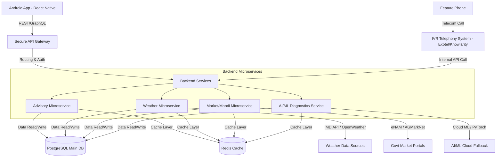

# AgriNexus 🌾 — Smart Crop Advisory System

> **Empowering Small & Marginal Farmers with AI-Driven Agricultural Intelligence** 

## 📖 Executive Summary
**AgriNexus** is a mobile-first, AI-powered Smart Crop Advisory System designed exclusively for small and marginal farmers in India (the 85% of the farming community owning less than 2 hectares of land). 

The platform consolidates fragmented agricultural services into a single, unified application supporting **English, Hindi, Tamil, and Telugu**. Crucially, it extends accessibility beyond smartphones to feature phone users through a toll-free **Interactive Voice Response (IVR)** system. Designed to operate under real-world rural constraints, AgriNexus is optimized for low-bandwidth networks, includes an offline cache for key content.

---

## 🛠️ Key Features

### `F1` Multilingual Crop Advisory Chatbot
* **Dual Modes:**
  * **Text Chat:** Intuitive tap-to-ask questions about crop calendars, crop rotation, sowing, irrigation, and fertilizer dosage.
  * **Conversational Voice:** Fully hands-free mode designed for farmers working in the field; speaks naturally and responds in voice.
* **RAG-Powered Chat:** Uses Retrieval-Augmented Generation (RAG) to deliver context-aware, accurate, and source-backed answers for chat queries.
* **Integrations:** Rasa NLP + Bhashini API / Google Speech-to-Text (STT) for online translation synchronization.


### `F2` AI Pest & Disease Detection
* **Camera Scanning:** On-device camera capture of crop issues (leaves, stems, fruits).
* **AI Diagnostic Engine:** Identifies **100+ common pests and diseases** across major crop varieties.
* **Treatment Guidance:** Instant recommendations detailing pesticide/organic remedies, safe dosages, and application timing.
* **Offline Cache:** Saves the last 5 scans locally.
* **Integrations:** Cloud ML + API(for remedies).

### `F3` Market Prices 
* **Real-Time Prices:** Daily mandi price updates for **200+ commodities** across all Indian states.
* **Price Trend Analysis:** Visual charts displaying 7-day and 30-day price history to help farmers decide the best time to sell.
* **Geo-Location Integration:** Auto-detects nearest physical mandis with distance and contact info.
* **Integrations:** National Agriculture Market (eNAM) API and AGMarkNet API.
* **Offline Fallback:** Caches last known prices for offline viewing under poor connectivity.


### `F4` AI Soil Health & Fertilizer Guidance
* **Lab-Free Assessments:** Multi-modal AI pipeline generating personalized soil health indicators without formal soil lab testing.
* **Guided Pipeline:**
  1. **Soil Image Input:** Analyzes soil color, texture, dryness, cracks, and moisture levels via camera.
  2. **Conversational Q&A:** Voice-guided questions covering crop history and simple conditions (e.g., salinity, water retention).
  3. **Location Weather Analysis:** Fetches GPS location, temperature, humidity, and drought index.
  4. **AI Recommendation:** Delivers speech and illustrated suggestions for soil improvement and fertilizer timing.

### `F5` Weather Forecasts & Alerts
* **Hyper-Local Forecasts:** 7-day predictive weather reports based on device GPS.
* **Push Notifications:** Instant alerts for critical weather anomalies (drought, frost, heavy rain, heatwaves).
* **Irrigation Advisory:** Recommends optimal watering schedules based on the weather forecast.
* **Integrations:** India Meteorological Department (IMD) API + third-party weather data feeds.

### `F6` IVR System (Feature Phones)
* **Equal Access:** A toll-free number accessible from any mobile or landline without internet.
* **Voice-Only UI:** Voice menus in regional languages providing weather, crop advice, pest help, and mandi prices.
* **Integrations:** Telecom IVR providers (Exotel or Knowlarity).

---

## 📐 System Architecture & Data Flows

AgriNav leverages a multi-layer microservices architecture to ensure high scalability and seamless offline-online transition:



---

## 💻 Tech Stack

| Layer | Technology | Rationale |
| :--- | :--- | :--- |
| **Mobile Frontend** | React Native | Cross-platform compatibility; Android-first deployment (iOS in Phase 2) |
| **Local Storage** | SQLite (via WatermelonDB) | High-performance offline DB to store chatbot models and cached content |
| **Backend API** | Django (Python) / Node.js | Scalable API structure; Python for AI model interface |
| **Database** | PostgreSQL + Redis | Relational data persistence with fast cache-invalidation cycles |
| **AI/ML Engine** | TensorFlow Lite + PyTorch | Hybrid engine for fast on-device inference and heavy cloud computation |
| **NLP Chatbot** | Rasa NLP + Bhashini / Google STT | Advanced Indian language translation, speech recognition, and RAG (Retrieval-Augmented Generation) for chat content |
| **IVR Telephony** | Exotel / Knowlarity | Enterprise-grade telephony integration for rural reach |
| **Monitoring** | Sentry + Firebase Crashlytics | Real-time crash monitoring and user behavior metrics |

---

## 📈 Non-Functional Requirements & Targets

* **Performance:** App cold start time `< 5 seconds`.
* **AI Responsiveness:** Pest/disease image classification response `< 5 seconds` (cloud mode).
* **Offline Caching:** Automatic caching of F1 (Market Prices) and F5 (Weather Forecasts).
* **Bandwidth Optimization:** Payload compression (`gzip`/`Brotli`) ensuring `< 50KB` per REST API request.
* **Security:** AES-256 encryption at rest; TLS 1.3 in transit. Passwordless OTP-based verification.
<!-- * **System Availability:** 99.5% uptime SLA supporting `100,000` concurrent users at launch. -->

---

## 📂 Project Structure

```directory
Crop_Advisory/Project/
├── backend/                  # Django backend application
│   ├── backend/              # Django project settings & configuration
│   └── manage.py             # Django management script
├── docs/                     # Project documentation
│   └── AgriNav_PRD_v1.3.pdf  # Product Requirements Document
├── .env                      # Environment configurations (ignored by git)
├── .gitignore                # Git ignore configuration
├── requirements.txt          # Python backend dependencies
└── README.md                 # Project Overview (This File)
```

---
